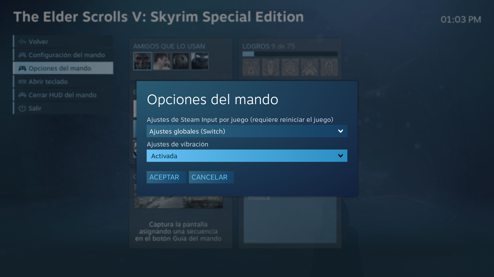

# CONFIGURACIÓN DE HYDRA

## BIOS

### MEMORIA RAM

- Usar _perfil 1_ de XMP (va a 2933 MHz).

- Cuidado: al activar un perfil XMP se cambia automáticamente la curva de
  temperaturas y ventilación de la CPU, machacando los valores que había.

- El _perfil 2_ de XMP (que va a 3200 MHz) en principio es compatible según las
  especificaciones de la placa base, PERO hace que el test Prime95 Blend se
  rompa desde el primer momento, cosa que no pasa con el _perfil 1_. [TODO:
  Esto último parece que no es por culpa del _perfil 2_, sino que cuando hice
  la prueba tenía poca memoria libre. Probar de nuevo.]

### OVERCLOCK

- Desactivar `Precision Boost Overdrive`.

- La opción `Core Performance Boost` activa el overclocking automático que
  hacen los Ryzen. Si se desactiva, provoca los siguientes efectos:

  - La frecuencia queda clavada en 3,7 GHz.

  - El `CPU Core Voltage` baja de 1,446 V a 1,104 V.

- En el modo de voltaje automático, el `CPU Core Voltage` queda en 1,446 V. En
  los foros se comenta que puede ser un voltaje un poco alto. Yo le he puesto
  un offset al voltaje de -0,0500 V. [TODO: Probar con -0,1000 V.]

### VENTILADORES

#### CPU (`fan2` en `lm_sensors`)

- Ahora mismo lo tengo así:

  ```
  Temp.    %
  ------ -----
   20º     38
   65º     38
   75º     80
   85º    100

  Step up time: 0.7s
  Step down time: 1.0s
  ```

- Otras curvas que he probado:

  ```
  Temp.    %
  ------ -----
   20º     38
   60º     38
   70º     80
   85º    100

  Temp.    %
  ------ -----
   20º     40
   55º     40
   65º     80
   85º    100

  Temp.    %
  ------ -----
   20º     20
   50º     40
   65º     80
   85º    100
  ```

  pero como resulta que `Tdie` está continuamente dando pequeños saltos de unos
  10º, esto provoca que, en ese pico, el ventilador de la CPU pegue un salto y
  luego baje casi enseguida, lo que resulta molesto (y seguramente no sea muy
  bueno para el motor del ventilador).

  Para arreglarlo, pongo el ventilador a una velocidad constante de 38-40%
  hasta los 55º-60º-65º, y a partir de ahí subo la velocidad. [TODO: Probar por
  si hay que poner una rampa más empinada en situaciones de estrés.]

  Es mejor usar el 38% que el 40% para el ventilador de la CPU, porque al 40%
  se oye un zumbido molesto de vibración, sobre todo por la noche.

#### TRASERO (`SYSFAN1` en placa, `fan3` en `lm_sensors`)

- 516 V.

#### DELANTEROS (`SYSFAN3` en placa, `fan6` en `lm_sensors`)

- 516 V.

- Ahora mismo (2020-10-29) hace mucho menos ruido poniendo 660 V. Con 516 V se
  provocan vibraciones a intervalos de un segundo.

  Otra opción que parece bastante mejor es ponerlo a 492 V.

- Poner una curva dinámica en los ventiladores trasero o delanteros provoca
  vibraciones y ruido. Mejor poner un valor constante de 516 V. [TODO: Probar
  de nuevo.]

## CAJA

- No apretar todos los tornillos del cristal templado para así evitar ruidos,
  zumbidos y vibraciones molestas. Recomendado apretar sólo los dos tornillos
  superiores y dejar los inferiores al aire.

## MONITOR AOC

- `Contraste`: 50.

- `Brillo`: 40.

- `Gamma`: _Gamma3_.

- Activar `Adapt. Sync`.

## TECLADO INALÁMBRICO LOGITECH

- Poner el adaptador inalámbrico en los USB de delante.

- En los de detrás, no llega bien la señal.

## INSTALACIÓN DE DEBIAN GNU/LINUX

- Descargar la imagen no oficial de instalación por red con firmware no libre
  (firmware netinst ISO) desde:

  https://cdimage.debian.org/cdimage/unofficial/non-free/cd-including-firmware/11.1.0+nonfree/amd64/iso-cd/

- Durante la instalación, he encontrado problemas de conexión al seleccionar
  directamente el ESSID de la red inalámbrica. Lo soluciono seleccionando la
  opción de escribir yo el ESSID.

- En las opciones del sistema de archivos:

  - Crear una partición EFI de 512M al comienzo.

  - Crear la partición `ext4` con el resto del disco y usar con ella la opción
    `noatime` para mejorar el rendimiento.

    Si no se pone el `noatime` durante la instalación, se puede poner luego
    editando el `/etc/fstab` y cambiando `defaults` por `noatime`. Para activar
    en el momento sin tener que reiniciar, se puede hacer:

    `$ sudo mount -o remount /`

- Arrancamos el sistema recién instalado.

- Para tener red, añadimos lo siguiente en `/etc/network/interfaces`:

  ```
  auto wlo1
  iface wlo1 inet dhcp
      wpa-essid RentelWifi5
      wpa-psk <contraseña en claro>
  ```

  y luego:

  ```
  $ sudo systemctl restart networking.service
  ```

  (Cuando ya hayamos instalado NetworkManager y lo vayamos a usar, tendremos
  que quitar lo que acabamos de poner y reiniciar de nuevo el servicio
  `networking`.)

- No olvidarse de instalar amd64-microcode:

  ```
  $ sudo apt install amd64-microcode
  ```

- Instalamos X.Org e i3:

  ```
  $ sudo apt install i3 xinit
  ```

  Probar que funcionan las X.

  Al seleccionar la distribución del teclado, usar la variante `Español (tilde
  muerta)` para que salga el carácter `~` directamente al pulsar AltGr+Ñ.

  ```
  $ sudo apt install linux-headers-amd64 nvidia-drivers firmware-misc-nonfree
  ```

  Reiniciar y probar que funcionan las X con el módulo de nvidia.

  Probar también que funciona nvidia-settings. En este punto, a mí no me
  arrancaban (se arregla luego cuando pasamos a _testing_).

  El driver de nvidia 470.57.02 que hay en _testing_ falla al compilarse para
  el kernel 5.14.0, así que tenemos que quedarnos con el kernel 5.10.0 que hay
  en _stable_. Por eso, antes de pasar a _testing_ hay que hacer:

  ```
  sudo apt purge linux-headers-amd64 linux-image-amd64
  ```

  Ahora pasamos a _testing_ cambiando `/etc/apt/sources.list` y sustituyendo
  `bullseye` por `testing` con una búsqueda global.

  ```
  $ sudo apt update
  $ sudo apt full-upgrade
  ```

  Reiniciar, arrancar `nvidia-settings`, crear un `xorg.conf` y copiarlo en
  `/etc/X11`.

  ```
  $ sudo apt install firefox-esr firefox-esr-l10n-es-es git network-manager-gnome
  ```

  Instalamos la versión con gaps de i3:

  ```
  $ git clone https://github.com/maestrogerardo/i3-gaps-deb.git
  $ cd i3-gaps-deb
  $ ./i3-gaps-deb
  ```

- No olvidarse de instalar `lm-sensors`:

  ```
  $ sudo apt install lm-sensors
  $ sudo sensors-detect
  ```

  En el caso de `hydra`, sólo se necesita cargar el módulo `nct6775` poniéndolo
  en `/etc/modules`, cosa que `sensors-detect` puede hacer automáticamente si
  se lo permitimos.

- Instalamos nuestro script:

  ```
  $ git clone https://github.com/ricpelo/conf.git .conf
  $ cd .conf
  $ ./conf.sh
  ```

- Cuando hayamos instalado `pulseaudio`, tendremos que arrancar el servicio:

  ```
  $ systemctl --user restart pulseaudio.service
  ```

  (sin el `sudo`).

- Probablemente haya que ejecutar `lxappearance` para seleccionar el tema de
  escritorio y los iconos, aunque en teoría no haría falta.

- Hacer:

  ```
  $ sudo update-alternatives --config desktop-theme
  ```

  Elegir joy-theme.

- Actualizar el `grub` para que coja el tema nuevo:

  ```
  $ sudo update-grub
  ```

## TECLADO

(Fuente: https://wiki.debian.org/Keyboard)

- Las opciones del teclado se guardan en `/etc/default/keyboard`.

- El contenido que me viene bien es:

  ```
  KEYBOARD CONFIGURATION FILE

  # Consult the keyboard(5) manual page.

  XKBMODEL="pc105"
  XKBLAYOUT="es"
  XKBVARIANT="deadtilde"
  XKBOPTIONS="ctrl:swapcaps"

  BACKSPACE="guess"
  ```

- Al seleccionar la distribución del teclado durante la instalación, usar la
  variante `Español (tilde muerta)` para que salga el carácter `~` directamente
  al pulsar AltGr+Ñ.

- Hay que tener instalados los paquetes `keyboard-configuration` y
  `console-setup`.

- Para entrar en la configuración del teclado siempre que se quiera, hay que
  hacer:

  ```
  $ sudo dpkg-reconfigure keyboard-configuration
  ```

  Allí, seleccionar:

  - PC genérico 105 teclas
  - Español - Español (tilde muerta)

- Para aplicar la nueva configuación, hay que reiniciar el servicio
  `keyboard-setup` o todo el equipo.

- Para tener distribución de teclado español también en initramfs, hay que:

  - Poner lo siguiente en `/etc/initramfs-tools/initramfs.conf`:

    ```
    #
    # KEYMAP: [ y | n ]
    #
    # Load a keymap during the initramfs stage.
    #

    KEYMAP=y
    ```

  - Asegurarse de que ese mismo archivo contiene los módulos apropiados para
    soportar teclados USB:

    ```
    #
    # MODULES: [ most | netboot | dep | list ]
    #
    # most - Add most filesystem and all harddrive drivers.
    #
    # dep - Try and guess which modules to load.
    #
    # netboot - Add the base modules, network modules, but skip block devices.
    #
    # list - Only include modules from the 'additional modules' list
    #

    MODULES=most
    ```

  - Aplicar los cambios:

    ```
    $ sudo update-initramfs -u
    ```

## NVIDIA

- En _NVIDIA X Server Settings_:

  - Poner resolución 1920x1080 a 75 Hz.

  - En `Avanzada` poner `Allow G-SYNC on monitor not validated as G-SYNC
    Compatible`.

  - En `OpenGL Settings`:

    - Activar `Sync to VBlank`.

    - Activar `Allow G-SYNC/G-SYNC Compatible`.

    - La opción `Allow Flipping` se puede desactivar cuando se use _Steam Link_
      en la TV para que no parpadee, aunque eso sólo me pasaba en Ubuntu y no
      en Debian.

- Durante los juegos (y otras aplicaciones de uso intensivo de la tarjeta
  gráfica) es muy conveniente aplicar una curva de potencia (_fan curve_) a los
  ventiladores de la gráfica. Para ello, usar mi _fork_ de
  `https://github.com/nan0s7/nfancurve`:

  - Clonar el repositorio:

    ```
    $ git clone https://github.com/ricpelo/nfancurve.git
    ```

  - Arrancar el script `temp.sh` en una terminal y dejarla en segundo plano:

    ```
    $ ./temp.sh
    ```

  - La curva se puede cambiar en el archivo `config`.

## AUDIO

(Fuente: https://wiki.archlinux.org/index.php/PulseAudio/Troubleshooting)

- Para evitar que el micrófono tenga mucho ruido, lo mejor es usar un enchufe
  con toma de tierra. Eso elimina el ruido de raíz.

- Si no se puede, hacer:

  - `$ sudo vim /etc/pulse/default.pa`

    Añadir al final:

    ```
    load-module module-echo-cancel aec_method=webrtc aec_args="analog_gain_control=0 digital_gain_control=1" source_name=echoCancel_source
    set-default-source echoCancel_source
    ```

  - En el *Control de volumen* de PulseAudio, usar como *Dispositivo de
    entrada* el que ponga `echo cancelled...`.

  - `$ sudo vim /etc/pulse/daemon.conf`

    Establecer:

    ```
    default-sample-rate = 48000
    ```

## RED

(Fuente: https://askubuntu.com/questions/1196348/ubuntu-19-10-wont-connect-to-2-4ghz-wifi-with-txbf-mu-mimo-enabled)

- Para que pueda conectarse a la red WiFi 2.4 GHz con el router TP-Link AC1200,
  hay que usar `iwd` en lugar de `wpa_supplicant`. Para ello:

  1. Instalar `iwd`:

     ```
     sudo apt update
     sudo apt install iwd
     ```

  2. Crear el siguiente archivo dentro del directorio de archivos de
     configuración de NetworkManager:

     ```
     sudo vim /etc/NetworkManager/conf.d/wifi_backend.conf
     ```

  3. Copiar y pegar el siguiente contenido dentro de ese archivo, guardar y
     salir:

     ```
     [device]
     wifi.backend=iwd
     ```

  4. Parar y desactivar el servicio `wpa_supplicant` (la desactivación es
     persitente entre reinicios):

     ```
     sudo systemctl disable --now wpa_supplicant.service
     ```

  5. No activar el servicio `iwd`, en caso de que esté activado:

     ```
     sudo systemctl disable iwd.service
     ```

  6. Reiniciar el servicio de NetworkManager (así no habrá que reiniciar el
     equipo para que los cambios tengan efecto):

     ```
     sudo systemctl restart NetworkManager.service
     ```

- Si la conexión del sistema no conecta bien, podemos hacer lo siguiente:

  1. Borrar la conexión del sistema:

     ```
     sudo rm /etc/NetworkManager/system-connections/RentelWifi5.nmconnection
     ```

  2. Conectarse desde el applet de NetworkManager.

     Esa conexión que se crea no es del sistema porque no se guarda la
     contraseña. Por tanto, hacemos:

     a. Arrancamos el editor de conexiones:

        ```
        nm-connection-editor
        ```

     b. Elegimos la conexión que queremos (en mi caso, `RentelWifi5`) y
        pulsamos el botón de la rueda dentada.

     c. En la pestaña `Seguridad inalámbrica`, escribimos la contraseña y le
        damos a `Guardar`.

  Así ya se creará la conexión del sistema con la contraseña bien guardada.

## TIPOGRAFÍAS

- Si se instala el paquete `ttf-bitstream-vera`, en LyX no se ven bien los
  textos matemáticos. Dos soluciones:

  - Desinstalar el paquete `ttf-bitstream-vera` (es lo mejor).

  - Configurar LyX para usar las tipografías DejaVu en las tipografías de
    pantalla en _Herramientas -> Preferencias -> Apariencia -> Tipografías de
    pantalla_.

## SCRIPTS DE ARRANQUE

- `/etc/default/locale`   --> establece el `LANG`

- `/etc/pam.d/lightdm y /etc/pam.d/login`  --> cargan el `/etc/default/locale`

- En `/etc/environment` no se pone nada de `LANG` (de hecho, en Debian está
  vacío, por lo visto).

- En Zsh:

  - `/etc/profile`
  - `/etc/profile.d`
  - `~/.xsessionrc`   --> carga `/etc/profile` y `~/.profile`
  - `~/.zprofile`   --> carga `/etc/profile` y `~/.profile`
  - `~/.profile`  --> mete el `.local/bin` en el `PATH`

- Orden de arranque:

  - En un login interactivo:

    1. `/etc/zshenv`
    2. `~/.zshenv`
    3. `/etc/zprofile`
    4. `~/.zprofile`
    5. `/etc/zshrc`
    6. `~/.zshrc`
    7. `/etc/zlogin`
    8. `~/.zlogin`

  - En un no login interactivo:

    1. `/etc/zshenv`
    2. `~/.zshenv`
    3. `/etc/zshrc`
    4. `~/.zshrc`

  - En un script no interactivo:

    1. `/etc/zshenv`
    2. `~/.zshenv`

## GOOGLE CHROME CON CACHÉ EN RAM

- Para mejorar el rendimiento y no gastar demasiado el disco SSD, se puede
  guardar la caché de Google Chrome en un disco RAM. Para ello:

  - Borrar el directorio `~/.cache/google-chrome` si existiera:

    `$ rm ~/.cache/google-chrome`

  - Lo volvemos a crear vacío:

    `$ mkdir -p ~/.cache/google-chrome`

  - Crear un disco RAM de 1 GiB y montarlo en el directorio anterior. Para
    ello, modificamos el archivo `/etc/fstab`:

    `$ sudo vim /etc/fstab`

    y añadimos la siguiente línea:

    ```
    tmpfs /home/ricardo/.cache/google-chrome tmpfs user,noatime,nodev,nosuid,uid=1000,gid=1000,size=1024M 0 0
    ```

  - Reiniciamos el equipo.

- Como contrapartida, tenemos que la caché se limpia cada vez que se reinicia
  el ordenador.

## MOZILLA FIREFOX CON CACHÉ EN RAM

- Aprovechando lo que hemos hecho ya para Google Chrome en el punto anterior,
  se puede usar el mismo punto de montaje para guardar la caché de Firefox en
  RAM. Para ello:

  - Borrar el directorio `~/.cache/mozilla` si existiera:

    `$ rm ~/.cache/mozilla`

  - Abrimos Firefox y tecleamos `about:config` en la barra de direcciones.

  - Creamos una nueva entrada llamada `browser.cache.disk.parent_directory` de
    tipo cadena con el siguiente contenido:

    ```
    /home/ricardo/.cache/google-chrome
    ```

  - Guardamos y reiniciamos Firefox.

(Fuente: https://ubuntuforums.org/showthread.php?t=991205)

## APT PINNING

- Para estar en `testing` pero poder instalar puntualmente determinados
  paquetes de `unstable`, se puede hacer _APT pinning_.

- Comprobar que en `/etc/apt/sources.list` están las siguientes líneas:

  ```
  deb http://deb.debian.org/debian/ testing main non-free contrib
  deb-src http://deb.debian.org/debian/ testing main non-free contrib

  deb http://security.debian.org/debian-security testing-security main contrib non-free
  deb-src http://security.debian.org/debian-security testing-security main contrib non-free

  # testing-updates, to get updates before a point release is made;
  # see https://www.debian.org/doc/manuals/debian-reference/ch02.en.html#_updates_and_backports
  deb http://deb.debian.org/debian/ testing-updates main contrib non-free
  deb-src http://deb.debian.org/debian/ testing-updates main contrib non-free

  deb http://deb.debian.org/debian/ unstable main non-free contrib
  deb-src http://deb.debian.org/debian/ unstable main non-free contrib
  ```

  Especialmente, tener cuidado de que pone `testing` y `unstable`, y no
  `bookworm` ni `sid`.

- Crear el archivo `/etc/apt/apt.conf.d/99default-release`:

  `$ sudo vim /etc/apt/apt.conf.d/99default-release`

  con el siguiente contenido:

  ```
  APT::Default-Release "testing";
  ```

- Crear el archivo `/etc/apt/preferences.d/pinning-unstable`:

  `$ sudo vim /etc/apt/preferences.d/pinning-unstable`

  con el siguiente contenido:

  ```
  Package: *
  Pin: release a=testing
  Pin-Priority: 900

  Package: *
  Pin: release a=unstable
  Pin-Priority: 800
  ```

- Actualizar la lista de paquetes:

  `$ sudo apt update`

- A partir de ahora, cuando se quiera instalar un paquete de `unstable`, se usa
  la opción `-t` de `apt`:

  `$ sudo apt install -t unstable paquete`

## JUEGOS

- Algunos juegos no funcionan bien cuando está funcionando el compositor
  `picom`. En esos casos, pararlo mediante `killall picom` mejorará mucho el
  funcionamiento del juego.

  En mi configuración de i3, basta con pulsar `Super+i` para activar o
  desactivar el compositor `picom`.

- Para usar MangoHud, se pueden arrancar los juegos en Steam usando el
  parámetro de lanzamiento:

  ```
  mangohud %command%
  ```

  La configuración está en `~/.config/MangoHud/MangoHud.conf`. Está configurado
  para que no se muestre inicialmente hasta que no se pulse la combinación de
  teclas `Mayús+F12`.

  También se puede activar MangoHud en todos los juegos de Steam arrancándolo
  así:

  ```
  $ mangohud steam
  ```

### NINTENDO SWITCH PRO CONTROLLER

- Comprobar que está activo el Bluetooth mirando en `/etc/default/bluetooth`
  si existe la siguiente línea:

  ```
  BLUETOOTH_ENABLED=1
  ```

- La mejor forma de conectar el mando a través de Bluetooth es usar el cliente
  de consola `bluetoothctl`.

  - La primera vez:

    ```
    $ bluetoothctl
    # scan on
    (espera a ver Pro Controller)
    # scan off
    # pair 48:A5:E7:D0:94:29
    # trust 48:A5:E7:D0:94:29
    # connect 48:A5:E7:D0:94:29
    ```

  - Las siguientes veces no hace falta emparejar ni confiar. Basta con
    conectar:

    ```
    $ bluetoothctl
    # connect 48:A5:E7:D0:94:29
    ```

    Cosa que se puede hacer directamente desde la línea de órdenes:

    `$ bluetoothctl connect 48:A5:E7:D0:94:29`

    Y lo normal es que ni siquiera haga falta usar `connect`. Lo normal es que
    el mando se conecte solo, al pulsar cualquier botón del mando.

    Si en algún momento se perdiera el emparejamiento (cosa que ocurre, por
    ejemplo, cuando emparejamos el mando con la Nintendo Switch), tendremos que
    volver a repetir el proceso como si fuera la primera vez, eliminando
    previamente el dispositivo mediante:

    `$ bluetoothctl remove 48:A5:E7:D0:94:29`

  - Para desconectar el mando, se hace:

    `$ bluetoothctl disconnect 48:A5:E7:D0:94:29`

- Juegos fuera de Steam:

  - Desde la versión 5.16 del kernel, el controlador `hid_nintendo` ya viene
    cargado como un módulo de Linux, así que no hay que hacer nada en especial.

- En Steam:

  - Los controladores anteriores son incompatibles con el que usa Steam, así
    que hay que deshabilitarlos:

    - Crear `/etc/modprobe.d/blacklist-hid_nintendo.conf` con el siguiente
      contenido:
    
      ```
      blacklist hid_nintendo
      ```

    - `$ sudo systemctl disable joycond.service`

  - Dentro de Steam, hay que:

    - Usar siempre Big Picture.

    - Dejar que Steam detecte el mando como un _Nintendo Switch Pro
      Controller_.

    - Desactivar la vibración en las preferencias del mando:

      

    - La vibración se puede activar por cada juego de forma local durante una
      partida pulsando el botón de la casa y entrando en las opciones del
      mando:

      

    - La mayoría de los juegos funcionan mejor forzando el uso de Stem Input en
      las preferencias de cada juego dentro de Steam.

### STEAM EN NTFS

- Se pueden instalar juegos de Steam en un disco NTFS (como un disco externo
  USB). Para ello:

  - Hay que añadir una nueva _biblioteca_ en los ajustes de Steam:

    Steam -> Parámetros -> Descargas -> Carpetas de biblioteca de Steam

    Damos al `+` y añadimos una nueva biblioteca en

    `/media/ricardo/Elements/Juegos/VolumenSteam`

  - Para que funcionen correctamente los juegos que se ejecutan con Proton, hay
    que crear un enlace simbólico de la carpeta `compatdata` para que apunte a
    la que hay en el disco local:

    ```
    $ mv /media/ricardo/Elements/Juegos/VolumenSteam/steamapps/compatdata /media/ricardo/Elements/Juegos/VolumenSteam/steamapps/compatdata.viejo
    $ ln -sf /home/ricardo/.steam/steam/steamapps/compatdata /media/ricardo/Elements/Juegos/VolumenSteam/steamapps/compatdata
    ```

(Fuente: https://github.com/ValveSoftware/Proton/wiki/Using-a-NTFS-disk-with-Linux-and-Windows)

### STEAM LINK

- Para que la imagen no parpadee (ésto sólo me pasaba en Ubuntu):

  - En _NVIDIA X Server Settings_, opción `OpenGL Settings`:

    - Desactivar `Allow Flipping`.

- Para que el sonido no se vaya degradando y se pierda con el tiempo:

  - En _Control de volumen de PulseAudio_:

    - En `Configuración`, desactivar todos los perfiles de audio.

      Se creará automáticamente un dispositivo virtual `Dummy`. (Si no
      apareciera, arrancar primero Steam.)

- Cuando se acabe de jugar, se deben deshacer los cambios en sentido contrario.

(Fuente: https://github.com/ValveSoftware/steam-for-linux/issues/6749#issuecomment-753639362)

### ACENTOS Y CARACTERES ESPAÑOLES EN EL CHAT DE STEAM

- Para poder escribir acentos y caracteres españoles correctamente en Steam,
  tenemos que tener instalado el locale `en_US.UTF-8`. Para ello:

  ```
  $ sudo dpkg-reconfigure locales
  ```

  - Seleccionar `en_US.UTF-8` (además del `es_ES.UTF-8`, por supuesto).

  - Asegurarse de marcar `es_ES.UTF-8` como el locale predeterminado.

(Fuente: https://steamcommunity.com/app/221410/discussions/0/1760230437367808021/)

### THE TALOS PRINCIPLE

- Jugar en modo Big Picture.

- En `Configuración del mando`, seleccionar la configuración `Mando`.

### ALIEN ISOLATION

- Es mucho mejor usar Proton 5.0 que la versión nativa de Linux (va más suave y
  con más fps). Para ello:

  - Entrar en las Propiedades del juego.

  - En el apartado `Compatibilidad`, activar `Forzar el uso de una herramienta
    específica de compatibilidad para Steam Play`.

  - Usar `Proton 6.21-GE-2` para evitar microparones y mantener siempre una
    buena tasa de FPS.

  - En las opciones gráficas del juego, poner todo al máximo menos el mapa de
    texturas.

### CIVILIZATION V

- Para que no se bloquee casi al principio:

  - `$ vim .local/share/Aspyr/Sid\ Meier\'s\ Civilization\ 5/config.ini`

    Poner `MaxSimultaneousThreads = 16`

### THE ELDER SCROLLS V: SKYRIM - SPECIAL EDITION

- Para que se escuchen las voces y la música de fondo, poner los siguientes
  parámetros de lanzamiento:

  ```
  WINEDLLOVERRIDES="xaudio2_7=n,b" PULSE_LATENCY_MSEC=90 %command%
  ```

- Para poder jugar en Steam Link, hay que saltarse el launcher que trae por
  defecto. Para ello:

  - Entrar en la carpeta del juego (en `steamapps/common/Skyrim Special
    Edition`).

  - Intercambiar los nombres de los ejecutables `SkyrimSE.exe` y
    `SkyrimSELauncher.exe`.

### FALLOUT 4

- Para que se escuchen las voces y la música de fondo, poner los siguientes
  parámetros de lanzamiento:

  ```
  WINEDLLOVERRIDES="xaudio2_7=n,b" PROTON_NO_ESYNC=1 %command%
  ```

- Configurar todo a `Ultra` excepto `Distancia de sombras` a `Medio`.

  También se puede usar ENABLE_VKBASALT=1 para darle una sutil mejora a los
  gráficos.

  (Fuente: https://www.protondb.com/app/377160#jDuqIwqfVA)

- Para poder jugar en Steam Link, hay que saltarse el launcher que trae por
  defecto. Para ello:

  - Entrar en la carpeta del juego (en `steamapps/common/Fallout 4`).

  - Intercambiar los nombres de los ejecutables `Fallout4.exe` y
    `Fallout4Launcher.exe`.

### THE WITCHER 3: WILD HUNT

- Para que no haya caídas en el rendimiento en fps, poner todo a `Ultra`
  excepto:

  - `NVIDIA HairWorks`: No

  - `Alcance de visibilidad del follaje`: Alta

### MASS EFFECT 2

- Instalar y arrancar una vez.

- La primera vez que se arranca no hay sonido. Las siguientes veces ya sí.

- Extraer `ME2Controller-1.7.2.7z` sobre la carpeta `BioGame` de la instalación
  del juego.

- En Steam, configurar el mando en modo `Mando`.

- El juego se bloqueará si se intenta jugar sin conectarse a Cerberus.

### BIOSHOCK 2

- Para que se carguen bien las texturas y todo vaya más rápido, poner los
  siguientes parámetros de lanzamiento:

  ```
  PROTON_NO_ESYNC=1 %command% -nointro
  ```

### DEUS EX: HUMAN REVOLUTION

(Fuente: https://gaming.stackexchange.com/questions/147596/how-can-i-fix-stuttering-and-lag-issues-in-deus-ex-hr-directors-cut/147642)

- Al salir del juego hay que esperar unos tres minutos o matar el proceso.

- NO usar DirectX 11 para que se carguen correctamente todas las texturas.

- Para reducir bastante los tirones durante el juego:

  - Usar los siguientes parámetros de lanzamiento:

    ```
    PROTON_USE_DXVK=1 PROTON_NO_ESYNC=1 %command%
    ```

  - Poner un antialiasing bajo.

  - Investigar si se trata únicamente de la compilación de shaders. Si pasado
    un tiempo dentro del juego se arregla solo, es que era eso. En caso
    contrario:

  - `$ WINEPREFIX=~/.local/share/Steam/steamapps/compatdata/28050/pfx ~/.local/share/Steam/steamapps/common/Proton\ 5.0/dist/bin/wine regedit`

  - En `HKEY_CURRENT_USER\Software\Eidos\Deus Ex: HRDC`, poner `AllowJobStealing` a `0`.

### NO MAN'S SKY

- Usar la variante de Proton de GloriousEggroll versión GE-Proton7-20.

- En opciones gráficas:

  - Poner la primera opción (tamaño de texturas) a `Media` y el resto de
    opciones a `Alta`.

  - Activar el Vsync.

- La rama 6.0 de Proton funciona mejor que la 5.0.

- Usar los siguientes parámetros de lanzamiento:

  ```
  %command% -vgui
  ```

### DEATH STRANDING

- Desactivar Steam Input para que el juego detecte y gestione él solo el
  Nintendo Switch Pro Controller.

### AMNESIA: THE DARK DESCENT

(Fuente: https://steamcommunity.com/sharedfiles/filedetails/?id=2749061346)

- Create a file called steam_appid.txt with 57300 inside

- Crear un archivo llamado `steam_appid.txt` con `57300` dentro y guardarlo en
  el directorio raíz del juego:

  `$ echo 57300 > /media/ricardo/Elements/Juegos/VolumenSteam/steamapps/common/Amnesia\ The\ Dark\ Descent/steam_appid.txt`

- Usar los siguientes parámetros de lanzamiento:

  ```
  LC_ALL=es_ES.UTF-8 %command%
  ```

- Alternativamente, se podría usar la versión de Proton, que funciona muy bien
  pero tiene el defecto de que no se puede configurar el gamma.

### RISEN

(Fuentes: https://www.protondb.com/app/40300#0koszn85hC y https://www.pcgamingwiki.com/wiki/Risen#Mouse_sensitivity)

- Usar los siguientes parámetros de lanzamiento:

  ```
  DXVK_FRAME_RATE=75 %command%
  ```

- Cambiar el archivo `/media/ricardo/Elements/Juegos/VolumenSteam/steamapps/common/Risen/data/ini/ConfigDefault.xml` así:

  ```xml
  ...
    <Input>
      <Mouse
				ForceNumLockDisabled="true"
		    SensitivityX="-0.29f"
		    SensitivityY="0.05f"
		    InvertX="false"
		    InvertY="false"
			>
			</Mouse>
		</Input>
  ...
	<Timer
		AverageFPS="75.000000"
		FixedFPS="75.000000"
		MaxFPS="75.000000"
		MinFPS="75.000000"
	>
	</Timer>
  ...
  ```

### BATMAN ARKHAM ORIGINS

- Usar los siguientes parámetros de lanzamiento:

  ```
  %command% -nostartupmovies -d3d9
  ```

### ASSASSIN'S CREED ORIGINS

- Usar `GE-Proton7-42` en `Compatibilidad` para Steam Play.

- En las propiedades de Steam:

  - Una de dos:

    - O bien:

      - `Habilitar la interfaz de Steam en el juego`: No

      - `Utilizar el modo cine mientras SteamVR esté activo`: No

    - O bien: jugar en modo `Big Picture`.

  - Desactivar `Steam Input` en `Mando`.

- Usar los siguientes parámetros de lanzamiento:

  ```
  PROTON_LARGE_ADDRESS_AWARE=1 WINE_LARGE_ADDRESS_AWARE=1 DXVK_ASYNC=1 DXVK_FRAME_RATE=60 %command%
  ```

- En opciones gráficas dentro del juego:

  - `Modo ventana`: `Pantalla completa`.

  - `Frecuencia de actualización`: `75 Hz`.

  - `Sincronización vertical`: `Sí`.

  - `Límite de FPS`: `60`. [TODO: Probar con `Ninguno`]

- Para quitar la notificación que aparece en la esquina superior derecha sobre
  que la gráfica no es compatible:

  - Pulsar `Mayús+F2`.

  - Quitar las notificaciones en `Ajustes` -> `Notificaciones`.

  - **NO** volver a pulsar `Mayús+F2`, o el juego se bloqueará.

  - Pulsar `Esc`, luego mantener pulsado `Super+9` hasta que aparezca el
    escritorio 9, y luego volver al escritorio del juego.

- El juego no se termina de ejecutar correctamente. Hay que matar el proceso
  desde Steam.

### ELITE DANGEROUS

- Al instalar el juego, luego hay que instalar el contenido de **Elite
  Dangerous: Horizons** desde el lanzador. Tarda muchísimo.

- En la configuración gráfica, poner:

  - `Sincronización vertical`: `No`.

  - `Frecuencia de refresco`: `75 Hz`.

  - `Límite de cuadros por segundo`: `60 Hz`.

  - `Calidad`: `Ultra`.

- Usar _Minimal Elite Dangerous Launcher_ (`https://github.com/rfvgyhn/min-ed-launcher`).

- Usar los siguientes parámetros de lanzamiento:

  ```
  DXVK_ASYNC=1 DXVK_STATE_CACHE=0 alacritty -e ./MinEdLauncher %command% /autorun /edh4 /autoquit
  ```

## DNI ELECTRÓNICO

(Fuente: https://www.dnielectronico.es/PDFs/manuales_instalacion_unix/Manual_de_Instalacion_de_MulticardPKCS11_DNIE_v2.pdf)

- Descargar `https://www.dnielectronico.es/descargas/distribuciones_linux/libpkcs11-dnie_1.6.8_amd64.deb`

- Ejecutar:

  ```
  $ sudo apt install pcsc-tools pcsd pinentry-gtk2 libccid
  $ sudo dpkg -i libpkcs11-dnie_1.6.8_amd64.deb
  $ sudo apt -f install
  $ sudo systemctl start pcscd
  $ sudo pcsc_scan
  ```

- Seguir las indicaciones del PDF.

- Introducir el DNI boca abajo.
